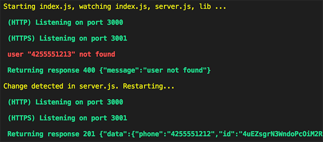

# nmc-watcher
A basic process runner/restarter for node, with no external dependencies, intended to automatically restart a server when a source file changes.



## Usage

```
watcher [options] <file_to_run> [<watch_file_or_dir>, [<watch_file_or_dir>, ...]]
```

### Options

`-n` or `--no-colors`: output without colors

### Examples

```bash
# Start index.js, and watch index.js, server.js, and the lib folder for changes.
#
$ node watcher index.js server.js lib
```

```bash
# Start without color output.
#
$ node watcher --no-colors index.js lib
```

## Notes
Developed on node `8.9.2` and uses `async/await`, so you'll need at least a node version that supports `async/await`.

If the server crashes, you will need to save a source file in order to restart the process.

To make using `watcher` even more handy you can start it with a script:

**Create a watch script file**

```bash
$ touch watch

$ chmod u+x watch
```

**Edit the watch script and add the following content**

```bash
#! /bin/sh

node watcher index.js server.js lib
```

**Run it**

```bash
$ ./watch

Starting index.js, watching index.js, server.js, lib ...

 (HTTP) Listening on port 3000
 (HTTPS) Listening on port 3001
```

## Issues

This script uses `fs.watch` which receives multiple change events when a file changes. `watcher` waits 2 seconds after killing the process before restarting it, but sometimes the change events are more than 2 seconds apart so changing a file will occasionally cause duplicate restarts. This shouldn't be much of a problem in practice.

Some rare circumstances may cause the server to be left running when `watcher` exits due to a crash. When this happens you may get a `EADDRINUSE` or similar error when trying to restart `watcher`. To fix this you'll need to kill the process manually. On linux/unix you should be able to use `lsof` to get the ID of a process at a given port:


```bash
$ lsof -i:3000
```

```
COMMAND  PID  USER   FD   TYPE             DEVICE SIZE/OFF NODE NAME
node    4132 james   11u  IPv6 0x3ac7180311e78f49      0t0  TCP *:hbci (LISTEN)
```

```bash
$ kill 4132
```

Alternately you can use Activity Monitor, System Monitor or an equivalent task manager to kill the node process.
